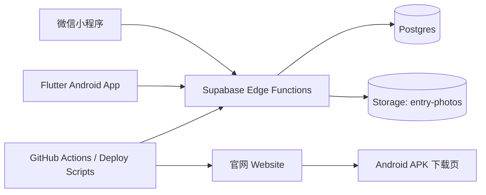

# FarmerNote1 / 初芽巡田

初芽巡田（FarmerNote）是一套面向农户与农事管理场景的多端系统，用于沉淀巡田记录、待办提醒、农时时间线，以及作物生命周期计划。当前重点覆盖小程序与 Android 端，并通过官网与 Supabase 云端能力完成下载、账号互通、数据同步和合规支撑。

## 项目目标

- 为农户提供低门槛的巡田记录入口，支持随手记、拍照、挂提醒。
- 把单条记录自动串成时间线，形成按天回看的农业工作日志。
- 通过待办模块承接未来提醒、逾期任务与已完成事项。
- 通过作物计划把“阶段 -> 里程碑 -> 动作标准”结构化，先支持小麦、玉米。
- 在多端之间实现本地优先、登录后合并、差异化增量同步。
- 满足隐私协议、用户协议、账号注销等合规要求。

## 核心功能

| 功能模块 | 说明 |
| --- | --- |
| 巡田记录 | 记录文字观察，可附带现场照片，并可关联作物计划动作来源。 |
| 提醒与待办 | 单条记录可挂未来时间，系统生成待办；当前待办以记录页底部模块为主入口。 |
| 时间线 | 按时间倒序或按天分组回看记录，展示纯记录、待办、逾期、已完成状态。 |
| 作物计划 | 面向河南/黄淮海口径，已支持小麦、玉米的生命周期计划，结构为阶段、里程碑、动作、执行标准。 |
| 云端账号 | 支持微信登录、手机号验证码登录、微信与手机号双通道绑定。 |
| 多端同步 | 登录后合并本地与云端数据；通过待同步队列和服务端版本号进行差异化同步。 |
| 媒体管理 | 照片采用“本地路径 + 云对象路径”双层模型，云端通过私有对象存储访问。 |
| 日历联动 | 可尝试写入手机系统日历，作为设备本地副作用，不参与跨端同步。 |
| 官网与下载 | 官网承载产品介绍、隐私政策、用户协议、账号注销说明与 Android 安装包下载页。 |
| 合规能力 | 冷启动协议确认、设置页协议入口、账号注销申请与定时清理。 |

## 当前产品形态

### 小程序

- 主入口为 `记录 / 时间线 / 计划 / 我`。
- 待办不再作为独立主页面，而是作为记录页底部模块呈现。
- 支持分享 `记录 / 时间线 / 计划` 页面到朋友与朋友圈。
- 计划能力已覆盖小麦、玉米，并可从计划动作直接跳到记录页生成建议草稿。

### Android App（Flutter）

- 以 Flutter 客户端承载 Android、iOS、Web、Desktop 的统一代码基线。
- 当前重点服务 Android 正式包发布，同时保留跨平台工程结构。
- 功能与小程序保持业务一致，差异主要来自平台能力，例如相机、日历、微信登录实现方式。

### 官网

- 对外提供产品介绍、下载入口、隐私政策、用户协议、账号注销页面。
- Android 下载页固定为 `https://web-t.chuya.wang/download/android/`。
- 官网同时承载 APK 下载、下载说明与版本信息展示。

## 系统架构



### 架构原则

- 本地优先：客户端先落本地状态，再决定是否进入云同步。
- 队列驱动：所有需上云的数据先转为 `pendingMutations`，再由 `sync-push` / `sync-pull` 处理。
- 增量同步：客户端基于 `lastSyncedVersion` 拉取差异，避免每次全量同步。
- 登录合并：用户登录后，本地未上云数据会标记为云跟踪对象，并与云端数据合并后再同步。
- 弱耦合媒体：记录正文与媒体对象分离，照片通过上传票据和下载票据访问。
- 平台分工明确：官网只负责展示与分发，客户端不直连数据库，所有受保护请求均走 Edge Functions。

## 数据模型

当前跨端核心实体如下：

| 实体 | 说明 |
| --- | --- |
| `EntryRecord` | 巡田记录主体，包含文字、照片对象路径、本地照片路径、计划来源字段。 |
| `TaskRecord` | 记录派生待办，包含提醒时间、状态、完成时间。 |
| `CropPlanInstance` | 某作物在某地区、某播种锚点日期下的用户实例。 |
| `CropPlanActionProgress` | 作物计划里某个动作的用户完成状态。 |
| `AuthSession` | 当前登录态、Access/Refresh Token 与用户档案。 |
| `SyncMutation` | 待上传的变更队列项，按实体类型与实体 ID 去重。 |

### 同步策略

- 客户端维护本地状态、待同步队列、最近服务端同步版本。
- 产生变更时仅为变更实体入队，不重新提交整个数据集。
- 登录后会把本地离线记录、待办、计划实例、计划动作进度提升为云跟踪对象。
- 被动同步带节流，主动同步仍可强制执行。
- 服务端按版本号返回增量变更，客户端再用 rebase 逻辑合并本地最新状态。

## 作物计划设计

作物计划模块当前面向“河南/黄淮海”场景，已内置：

- 小麦
- 玉米

计划结构：

- 阶段：例如播前与播种期、返青拔节期、抽穗扬花期。
- 里程碑：阶段内的大事项。
- 动作：最小执行单元，包含执行标准、步骤、注意事项。

系统支持：

- 设置播种日期作为时间锚点。
- 自动计算当前阶段与下一关键动作。
- 动作详情跳转记录页，生成巡田记录或提醒草稿。
- 动作完成状态在多端间同步。

该模型已为后续扩展大豆、花生等作物预留数据结构。

## 各程序端职责

| 端 / 目录 | 职责 | 技术形态 |
| --- | --- | --- |
| `miniprogram/` | 微信端主产品，承载记录、时间线、计划、设置、合规与小程序分享。 | 原生微信小程序 |
| `Flutter/apps/farmernote_app/` | 统一客户端代码基线，当前重点输出 Android 安装包。 | Flutter / Dart |
| `website/` | 官网前端、下载页、隐私政策、用户协议、账号注销说明。 | 静态 HTML / CSS / JS |
| `supabase/` | 云端数据同步、登录绑定、媒体票据、账号注销与限流。 | Supabase Edge Functions + Postgres + Storage |
| `html/` | 早期 Expo / React Native 版本，现为历史参考，不再作为主交付端。 | Expo / React Native（历史目录） |

## 技术架构

### 微信小程序

- 原生微信小程序框架
- `wx.setStorageSync` 本地持久化
- 业务状态集中在 `miniprogram/utils/store.js`
- 媒体、云同步、鉴权、作物计划均通过 `utils/` 目录拆分

关键页面：

- `pages/record`
- `pages/timeline`
- `pages/plan`
- `pages/settings`
- `pages/legal`
- `pages/account-deletion`

### Flutter / Android

- Flutter SDK
- Dart 3
- `shared_preferences`：本地状态持久化
- `image_picker`：拍照/选图
- `device_calendar`：系统日历写入
- `http`：调用 Supabase Functions
- `fluwx`：Flutter 微信登录能力
- 控制器中心为 `lib/app/farmernote_controller.dart`

### Website

- 纯静态站点，无前端框架依赖
- `site.css` 负责视觉系统与响应式布局
- `site.js` 负责下载页动态文案、复制链接、微信内打开提示等轻交互
- 通过版本号参数规避浏览器静态资源缓存

### Supabase

- Postgres：业务数据主库
- Storage：`entry-photos` 私有桶
- Edge Functions：
  - 认证登录：`auth-wechat-login`、`auth-phone-login`、`auth-link-phone`、`auth-link-wechat`、`auth-refresh`
  - 测试登录：`auth-dev-login`
  - 同步：`sync-push`、`sync-pull`
  - 媒体票据：`media-upload-ticket`、`media-download-ticket`
  - 账号注销：`account-request-deletion`、`account-deletion-status`、`account-purge-due`
- Migration 已覆盖云同步、限流、双通道身份、短信验证码、账号注销、作物计划

## 仓库结构

```text
FarmerNote1/
├── miniprogram/                     微信小程序主工程
├── Flutter/apps/farmernote_app/    Flutter 客户端工程
├── website/                         官网静态站点
├── supabase/                        数据库迁移与 Edge Functions
├── scripts/                         官网/测试/生产部署脚本
├── docs/                            补充文档与合规资料
├── resources/                       静态资源与素材
├── CLOUD_SYNC_SETUP.md              云同步配置与联调说明
└── html/                            早期 Expo 版本（历史参考）
```

## 运行与开发入口

### 小程序

1. 使用微信开发者工具导入 `miniprogram/`
2. 配置合法域名与 `cloud-config.js`
3. 真机调试或预览

### Flutter

```bash
cd /Users/wzp/Documents/GitHub/FarmerNote1/Flutter/apps/farmernote_app
flutter pub get
flutter analyze
flutter test
flutter run --dart-define-from-file=dart_defines.test.json
```

### Supabase

常用脚本：

```bash
./scripts/deploy_supabase_test.sh <project-ref> supabase/.env.test
./scripts/deploy_supabase_prod.sh <project-ref> supabase/.env.production
```

### Website

```bash
./scripts/deploy_website.sh
```

## 环境与发布

当前建议采用测试环境与正式环境分离：

| 类型 | 作用 |
| --- | --- |
| Test | 联调、验证新功能、小程序测试分支开发 |
| Production | 正式用户数据、正式 APK 下载与线上服务 |

相关说明：

- 官网对外域名与下载页由 `website/` 管理。
- 小程序与 Flutter 通过不同配置文件接入测试或生产 Functions 地址。
- GitHub Actions 已配置官网部署与账号定时清理任务。

## 重要约束

- 系统日历写入属于当前设备行为，不参与多端同步。
- 小程序环境无法像原生 App 那样提供完整本地通知能力，因此提醒更多依赖应用内待办与系统日历辅助。
- 客户端不直接访问数据库，所有受保护能力必须经 Edge Functions。
- `html/` 目录不是当前主产品线，不应继续作为新功能默认实现目标。

## 建议阅读顺序

1. 本 README：先理解全局产品与工程结构
2. [CLOUD_SYNC_SETUP.md](/Users/wzp/Documents/GitHub/FarmerNote1/CLOUD_SYNC_SETUP.md)：理解云同步联调与环境配置
3. [miniprogram/README.md](/Users/wzp/Documents/GitHub/FarmerNote1/miniprogram/README.md)：看小程序实现细节
4. [Flutter/apps/farmernote_app/README.md](/Users/wzp/Documents/GitHub/FarmerNote1/Flutter/apps/farmernote_app/README.md)：看 Flutter 工程细节
5. [supabase/README.md](/Users/wzp/Documents/GitHub/FarmerNote1/supabase/README.md)：看服务端能力与部署方式
6. [website/README.md](/Users/wzp/Documents/GitHub/FarmerNote1/website/README.md)：看官网部署与下载页约定

## 项目现状总结

初芽巡田已经从“单机记录工具”演进为“多端巡田记录 + 作物计划 + 差异化云同步”的农业工作流系统。当前主交付路径为：

- 小程序：快速记录与日常使用
- Android App：正式安装包与更完整的原生体验
- Supabase：统一账号、同步与媒体后端
- Website：对外展示、下载与合规入口

后续扩展重点通常会落在：

- 更多作物计划模板
- 更细的地区化农时策略
- 更强的主动提醒与农事准备提示
- Android/iOS 多端能力继续增强
